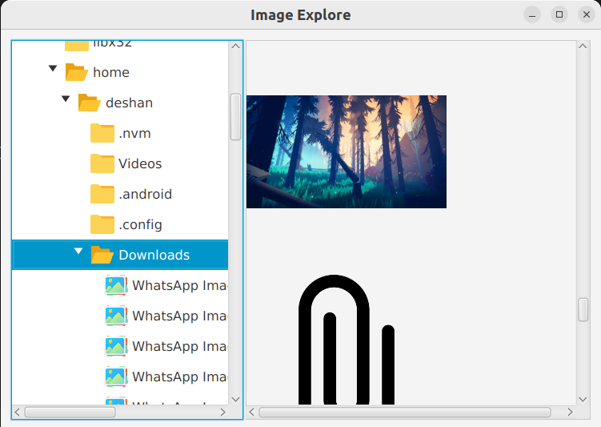

# Image Explorer App

## Overview
Image Explorer App is a Java application built using Scene Builder and IntelliJ IDEA that allows users to explore images within folders on their computer. Users can navigate through folders and view images if available.

## Features
- Explore folders on your computer
- View images within folders
- Navigate through folders
- Simple and intuitive user interface

## Prerequisites
- [Scene Builder](https://gluonhq.com/products/scene-builder/)
- [Intellij IDEA](https://www.jetbrains.com/idea/)
- [Java](https://www.oracle.com/java/)

## License
Copyright & copy ; 2024 Dep12 All Rights Reserved. 
This project is licensed under [MIT](LICENSE.txt).

## version
0.1.0